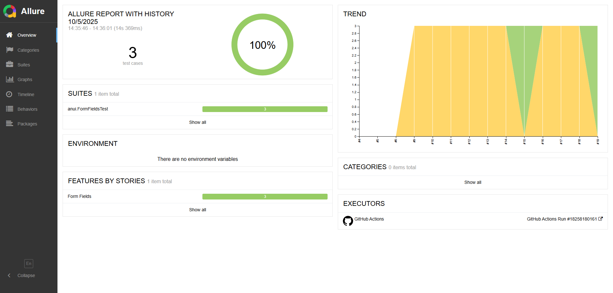

# Silicium 3.0 UI Tests

## Общее описание
Проект содержит автотесты пользовательского интерфейса для страницы [Form Fields сайта Practice Automation](https://practice-automation.com/form-fields/) и банковского приложения [XYZ Bank](https://www.globalsqa.com/angularJs-protractor/BankingProject/#/manager). 

Набор сценариев для сайта practice-automation покрывает ключевые проверки формы: корректное заполнение всех полей, позитивный сценарий с заполнением только обязательных полей и негативный кейс с пропуском заполнения обязательных. 

Тест кейсы для сервиса XYZ Bank касаются исключительно функционала менеджера, включая создание аккаунта клиента банка, его удаление ,а так же корректность работы интерфейса, в частности сортировки в таблице со списком клиентов банка.

Тесты запускаются в Chrome, снимаются скриншоты при падениях кейсов, а результат собирается в [Allure отчет](https://zen2281488.github.io/Silicium_3_0).

## Стек
- Java 17
- Maven 3.8+
- Selenium 4 (ChromeDriver через Selenium Manager)
- JUnit 5
- Allure Framework
- AspectJ (javaagent для вложений Allure)

## Структура репозитория
- `pom.xml` — агрегирующий POM и общие версии зависимостей.
- `.github/workflows/workflow.yml` — GitHub Actions для сборки, запуска тестов и публикации Allure-отчёта в `gh-pages`.
- `UI/pom.xml` — модуль UI-тестов и конфигурация Surefire/Allure.
- `UI/src/main/java/page/anui/FormFieldsPage.java` — Page сайта practice-automation.
- `UI/src/main/java/page/xyzbank/ManagerPage.java` — Page сайта XYZ Bank.
- `UI/src/main/java/util` — расширения JUnit для WebDriver и Allure attach, утилиты, вынесенные из page методы с логикой.
- `UI/src/test/java/anui` — пакет с тестовым классом  `FormFieldsTest` для сайта practice-automation.
- `UI/src/test/java/xyzbank` — тестовый класс  `ManagerPage` для сайта XYZ Bank.
- `UI/src/test/resources/conf.properties` — базовые настройки запуска.

## Требования
- Установленные Java 17+ и Maven 3.8+ (`java -version`, `mvn -version`).
- Google Chrome (стабильный или Chromium) — Selenium Manager автоматически подберёт драйвер.
- Allure Commandline (опционально) для локального просмотра отчётов.

## Подготовка окружения
```bash
git clone https://github.com/zen2281488/Silicium_3_0.git
cd Silicium_3_0
```
Убедитесь, что Maven видит зависимости (`mvn -pl UI dependency:resolve`). Первичный прогон `mvn clean test` скачает необходимые артефакты.

## Конфигурация
Файл `UI/src/test/resources/conf.properties` содержит:
- `practiceAutomationBaseUrl` — адрес тестируемой страницы сайта practice-automation (по умолчанию `https://practice-automation.com/form-fields/`).
- `xyzBaseUrl` — адрес тестируемой страницы сайта XYZ Bank (по умолчанию `https://www.globalsqa.com/angularJs-protractor/BankingProject/#/`).
- `headlessMode` — `true` для headless запуска (используется в CI). Измените на `false`, если нужно увидеть браузер локально.

## Запуск тестов
- Полный прогон из корня проекта:
  ```bash
  mvn clean test
  ```
- Запуск только UI-модуля:
  ```bash
  mvn -pl UI -am clean test
  ```
- Избирательный запуск класса или метода (пример):
  ```bash
  mvn -pl UI -Dtest=FormFieldsTest#fillFormPTest test
  ```
Результаты Allure сохраняются в `UI/target/allure-results`.

## Отчёты Allure
Для локального просмотра используйте любой из вариантов:
```bash
mvn -pl UI allure:report && mvn -pl UI allure:serve
# или, при установленном allure CLI
allure serve UI/target/allure-results
```

GitHub Actions генерирует отчёт в ветке `gh-pages` ([ознакомится с примером отчета можно по этому адресу](https://zen2281488.github.io/Silicium_3_0)) и сохраняет историю между прогонами.

## Список тест кейсов

---
<details>
  <summary>Кейсы для practice-automation.com</summary>

| №1                  | -                                                                                                                                                                                                                                                                                                                                                                                                                                                                                                                                                                                                                                           |
|---------------------| ------------------------------------------------------------------------------------------------------------------------------------------------------------------------------------------------------------------------------------------------------------------------------------------------------------------------------------------------------------------------------------------------------------------------------------------------------------------------------------------------------------------------------------------------------------------------------------------------------------------------------------------- |
| ID                  | T-001                                                                                                                                                                                                                                                                                                                                                                                                                                                                                                                                                                                                                                       |
| Описание            | Тестирование работоспособности базовой функциональности формы Form Fields.                                                                                                                                                                                                                                                                                                                                                                                                                                                                                                                                                                  |
| Предусловие         | Открыта страница https://practice-automation.com/form-fields/                                                                                                                                                                                                                                                                                                                                                                                                                                                                                                                                                                               |
| Шаги                | 1. Ввести «Testovlev Test Testovich» в поле имени `id="name-input"`.<br>2. Ввести «qwertyTest123» в поле пароля `css = input[type="password"]`.<br>3. Отметить чекбокс  «Coffee» и «Milk» из списка чекбоксов What is your favorite drink? `css = input[name='fav_drink']`.<br>4. Выбрать цвет «Yellow» в списке What is your favorite color? `css = input[name='fav_color']`.<br>5. Выбрать значение «Yes» в селекторе Do you like automation? `id="automation"`.<br>6. Ввести «test@test.ru» в поле email `id="email"`.<br>7. Ввести в поле Message `id="message"` текст "5 Katalon Studio".<br>8. Нажать кнопку Submit`id="submit-btn"`. |
| Ожидаемый результат | Появился алерт с текстом «Message received!».                                                                                                                                                                                                                                                                                                                                                                                                                                                                                                                                                                                             |
---

| №2          | -                                                                                                                       |
|-------------|-------------------------------------------------------------------------------------------------------------------------|
| ID          | T-002                                                                                                                   |
| Описание    | Тестирование работоспособности функциональности формы Form Fields при заполнении исключительно обязательного поля Name. |
| Предусловие | Открыта страница https://practice-automation.com/form-fields/                                                           |
| Шаги        | 1. Ввести «Testovlev Test Testovich» в поле Name `id="name-input"`.<br>2. Нажать кнопку Submit`id="submit-btn"`.        |
| Ожидаемый результат   | Появился алерт с текстом «Message received!».                                                                           |     |

---

| №3          | -                                                                                                                                                                                                                                                                                                                                                                                                                                                                                                                                                           |
|-------------|-------------------------------------------------------------------------------------------------------------------------------------------------------------------------------------------------------------------------------------------------------------------------------------------------------------------------------------------------------------------------------------------------------------------------------------------------------------------------------------------------------------------------------------------------------------|
| ID          | T-003                                                                                                                                                                                                                                                                                                                                                                                                                                                                                                                                                       |
| Описание    | Проверка нативной валидации поля Name при попытке отправить форму без имени.                                                                                                                                                                                                                                                                                                                                                                                                                                                                                |
| Предусловие | Открыта страница https://practice-automation.com/form-fields/                                                                                                                                                                                                                                                                                                                                                                                                                                                                                               |
| Шаги        | 1. Ввести «qwertyTest123» в поле Password `css = input[type="password"]`.<br>2. Отметить чекбоксы «Coffee» и «Milk» из списка What is your favorite drink? `css = input[name='fav_drink']`.<br>3. Выбрать цвет «Yellow» в списке What is your favorite color? `css = input[name='fav_color']`.<br>4. Выбрать значение «Yes» в селекторе Do you like automation? `id="automation"`.<br>5. Ввести «test@test.ru» в поле Email `id="email"`.<br>6. Ввести в поле Message `id="message"` текст "5 Katalon Studio".<br>7. Нажать кнопку Submit`id="submit-btn"`. |
| Ожидаемый результат   | Поле Name подсвечено нативной валидацией `:invalid`, алерт с текстом «Message received!» не отображается.                                                                                                                                                                                                                                                                                                                                                                                                                                                   |
</details>

---
<details>
  <summary>Кейсы для XYZ Bank</summary>

| №1                  | -                                                                                                                                                                                                                                                                                                                                                                                                                                                                             |
|---------------------|-------------------------------------------------------------------------------------------------------------------------------------------------------------------------------------------------------------------------------------------------------------------------------------------------------------------------------------------------------------------------------------------------------------------------------------------------------------------------------|
| ID                  | T-004                                                                                                                                                                                                                                                                                                                                                                                                                                                                         |
| Описание            | Тестирование работоспособности базовой функциональности создания нового клиента банка                                                                                                                                                                                                                                                                                                                                                                                         |
| Предусловие | Открыта страница https://www.globalsqa.com/angularJs-protractor/BankingProject/#/                                                                                                                                                                                                                                                                                                                                                                                             |
| Шаги                | 1. Нажать Add Customer.<br>2. Ввести валидное значение в поле First Name (сгенерированное по индексу).<br>3. Ввести «Testovlev» в поле Last Name.<br>4. Ввести валидное значение в поле Post Code (случайный индекс).<br>5. Нажать кнопку Add Customer (Submit) в форме добавления клиента.<br>6. Перейти в Open Account и в селекторе Customer выбрать созданного клиента <First Name> Testovlev (проверка появления в списке).<br>8. Перейти в Customers и найти строку с клиентом <First Name> Testovlev. |
| Ожидаемый результат | Отображается alert c текстом «Customer added successfully with customer id : <id>». Созданный клиент доступен в селекторе Customer на странице Open Account и присутствует в таблице Customers.                                                                                                                                                                                                                                                                                                                                                                                                                               |
---

| №2          | -                                                                                                                       |
|-------------|-------------------------------------------------------------------------------------------------------------------------|
| ID          | T-005                                                                                                                   |
| Описание    | Тестирование работоспособности сортировки списка клиентов банка по First Name |
| Предусловие | Открыта страница https://www.globalsqa.com/angularJs-protractor/BankingProject/#/                                                                                                                                                                                                                                                                                                                                                                                                                                                                                             |
| Шаги        | 1. Перейти в раздел Customers.<br>2. Кликнуть по заголовку колонки First Name для сортировки по возрастанию (ASC).<br>3. Проверить, что значения в колонке First Name отсортированы по возрастанию.<br>4. Ещё раз кликнуть по заголовку First Name для сортировки по убыванию (DESC).<br>5. Проверить, что значения в колонке First Name отсортированы по убыванию. |
| Ожидаемый результат   | После первого клика список клиентов отсортирован по First Name по возрастанию; после второго клика — по убыванию.                                                                                                                                                                                                                                                                                                                                                                                                                                              |

---

| №3          | -                                                                                                                                                                                                                                                                                                                                                                                                                                                                                                                                                      |
|-------------|--------------------------------------------------------------------------------------------------------------------------------------------------------------------------------------------------------------------------------------------------------------------------------------------------------------------------------------------------------------------------------------------------------------------------------------------------------------------------------------------------------------------------------------------------------|
| ID          | T-006                                                                                                                                                                                                                                                                                                                                                                                                                                                                                                                                                  |
| Описание    | Тестирование работоспособности удаления клиента банка                                                                                                                                                                                                                                                                                                                                                                                                                                                                           |
| Предусловие | Открыта страница https://www.globalsqa.com/angularJs-protractor/BankingProject/#/                                                                                                                                                                                                                                                                                                                                                                                                                                                                                        |
| Шаги        | 1. Перейти в раздел Customers.<br>2. Найти строку клиента Neville / Longbottom.<br>3. Нажать Delete в строке найденного клиента.<br>4.Перейти в Open Account либо обновить список клиентов. |
| Ожидаемый результат   | Клиент Neville Longbottom отсутствует в таблице Customers (не находится при поиске).                                                                                                                                                                                                                                                                                                                                                                                                                                             |
</details>

## CI/CD
Workflow `.github/workflows/workflow.yml` запускается на каждый push (кроме изменений только в Markdown-файлах), готовит среду с Chrome и Allure CLI, выполняет `mvn clean test`, собирает отчёт и публикует его в `gh-pages`. При падении тестов job помечается как неуспешный.


